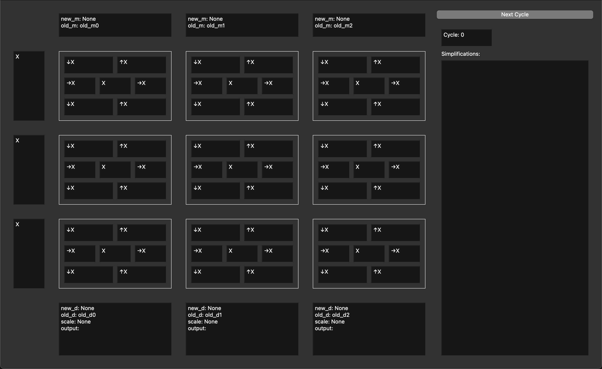

# FSA: Fusing FlashAttention within a Single Systolic Array

**FSA executes _every_ FlashAttention operation within a single systolic array — without requiring vector units!**  
Enjoy computing non-matrix-multiplication operations using matrix-multiplication FLOPs.

- Attention operations are overlapped element-wise within the systolic array to minimize execution latency.
- FSA achieves 1e-3 accuracy compared to `torch.nn.functional.scaled_dot_product_attention` on `fp16`.



---

## 🚀 Setup

> **Note:** Do **not** clone this repository directly. The commands below will automatically clone FSA as a submodule under `chipyard-fsa/generators/`.

FSA depends on [Chipyard](https://github.com/ucb-bar/chipyard),
and Chipyard requires the [Conda](https://docs.conda.io/en/latest/) package manager.
If you don't have Conda installed, please follow the Conda installation documentation
or use the following command:
```bash
wget https://repo.anaconda.com/miniconda/Miniconda3-latest-Linux-x86_64.sh
sh Miniconda3-latest-Linux-x86_64.sh
```

To use FSA within Chipyard:

```bash
git clone git@github.com:VCA-EPFL/chipyard-fsa.git
cd chipyard-fsa
./build-setup.sh --skip-ctags --skip-firesim --skip-marshal
# Make sure this is executed before running RTL simulation
source env.sh
```

---

## Run RTL Simulation

### 1. Install [`uv`](https://docs.astral.sh/uv/getting-started/installation/):

```bash
curl -LsSf https://astral.sh/uv/install.sh | sh
```

### 2. Generate the Verilator simulator binary:

```bash
cd chipyard-fsa/sims/verilator
# Generate a 4x4 Fp16-mul-Fp32-acc systolic array
make CONFIG=FSA4X4Fp16Config
```

See [`FSAConfig.scala`](https://github.com/VCA-EPFL/chipyard-fsa/blob/msaga-main/generators/chipyard/src/main/scala/config/FSAConfig.scala) for more available configurations.

### 3. Run FlashAttention using the FSA Python API:

The FlashAttention kernel for FSA is in the file [main.py](python/main.py). To run it, simply use the following commands:

```bash
cd chipyard-fsa/generators/fsa/python
uv run main.py --seq_q 4 --seq_kv 4 --config FSA4X4Fp16Config
```

### 4. (Optional) Value-by-value floating-point error checking:

FSA uses hardware floating-point arithmetic from [EasyFloat](https://github.com/VCA-EPFL/easyfloat), which simplifies subnormal handling compared to [HardFloat](https://github.com/ucb-bar/berkeley-hardfloat).

A Python software library also serves as a *golden reference*, allowing value-by-value comparison with hardware results.

To enable detailed error checking, use:

```bash
cd chipyard-fsa/generators/fsa/python
uv run main.py --seq_q 4 --seq_kv 4 --config FSA4X4Fp16Config --diff --diff_verbose
```

Example output:

```
Comparing with Torch...
Error of FSA vs torch:         {'MAE': np.float32(9.6587464e-05), 'MSE': np.float32(1.6099552e-08), 'MaxErr': np.float32(0.00030440092), 'RelErr': np.float32(0.00019886618)}
Error of PyEasyFloat vs torch: {'MAE': np.float32(9.6587464e-05), 'MSE': np.float32(1.6099552e-08), 'MaxErr': np.float32(0.00030440092), 'RelErr': np.float32(0.00019886618)}
```

---

## FPGA Support

Support for **Xilinx U55C** is coming soon!